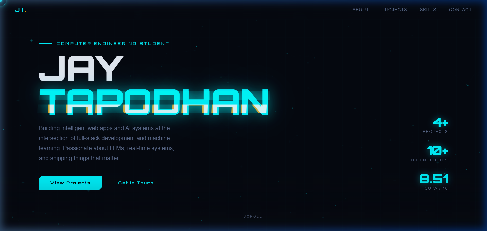

# Jay Tapodhan

**Computer Engineering Student · Full-Stack Developer · AI Enthusiast**

Building intelligent web apps and AI systems at the intersection of full-stack development and machine learning.

---

---

## About Me

4th-year Computer Engineering student at MBIT, CVM University with hands-on experience building AI-powered applications and full-stack web systems. From LLM-based chatbots to real-time task management platforms — I ship things that work.

Previously interned at **Flaunch** as an AI Technology Intern and trained at **IBM** as a Full Stack Development Trainee.

---

## What I Work With

`React.js` · `Node.js` · `Express.js` · `MongoDB` · `Python` · `Flask` · `LLaMA / Ollama` · `Firebase` · `REST APIs` · `Tailwind CSS` · `Git` · `SQL`

---

## Featured Projects

| Project | Description | Stack |
|---------|-------------|-------|
| **[TaskFlow](https://github.com/Ethical-21/taskflow-app)** | Production-grade team task manager with role-based assignment, real-time dashboards, and JWT auth. [Live ↗](https://taskflow-app-flame-kappa.vercel.app/) | React · Node · Express · MongoDB |
| **Smart Recipe Generator** | AI-powered recipe & meal planner using GROQ API with Firebase auth. | React · Firebase · GROQ API |
| **Reading Comprehension Assistant** | Offline AI tool that summarizes documents & generates questions using LLaMA 3.2 via Ollama. | Python · LLaMA 3.2 · NLP |

---

## About This Site

This portfolio features cinematic scroll animations, interactive HTML Canvas backgrounds (lattice grids, hex networks, matrix rain), a custom cursor, seamless gradient-based section transitions, and a fully responsive layout — all built with **React 19 + TypeScript + Vite**.

---

## Let's Connect

I'm open to internships, collaborations, and projects at the edge of web and AI.

- **Email** — [jaytapodhan21@gmail.com](mailto:jaytapodhan21@gmail.com)
- **LinkedIn** — [linkedin.com/in/jaytapodhan](https://www.linkedin.com/in/jaytapodhan/)
- **GitHub** — [github.com/Ethical-21](https://github.com/Ethical-21)

---

**Built with ❤️ by Jay Tapodhan**

